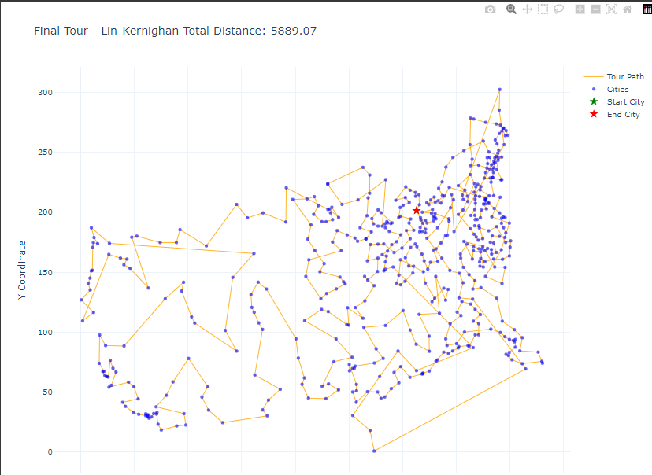
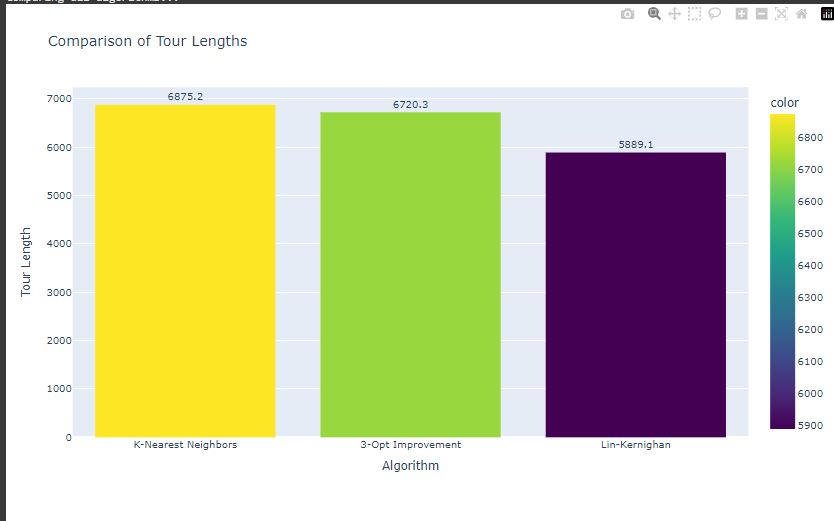
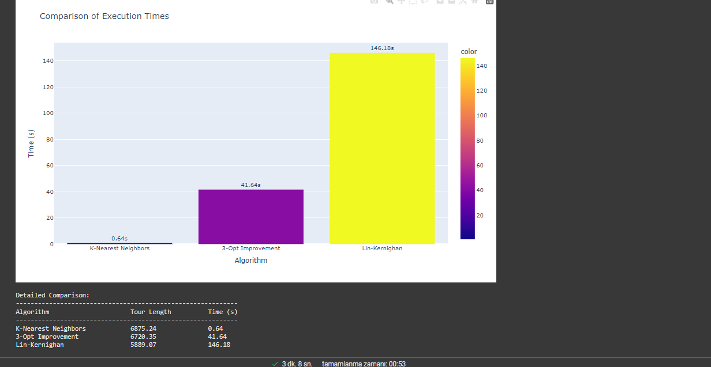

109
110
111
112
113
114
115
116
117
118
119
120
121
122
123
124
125
126
127
128
129
130
131
132
133
134
135
136
137
138
139
140
141
142
143
144
145
146
147
148
149
150
151
152
153
154
155
156
157
158
159
160
161
162
# CityCoordinatesAlgorithm for Autonomous Systems: Hackathon Challenge

- **Tour Length:** 5889.07

### 4. Comparison of Tour Lengths

### 5. Comparison of Execution Times

---

## Results

- **Initial Tour (KNN):** Length = 6875.24, Time = 0.64s
- **Improved Tour (3-Opt):** Length = 6720.35, Time = 41.64s
- **Final Tour (Lin-Kernighan):** Length = 5889.07, Time = 146.18s

Additional Results:
- **Nearest Neighbor (Multi-Start):** Length = 5220.83, Time = 1.32s
- **NN + 2-opt:** Length = 5086.96, Time = 5.34s
- **Ant Colony Optimization:** Length = 6338.44, Time = 22.46s

---

## Applications

- **Autonomous Vehicle Routing**
- **Logistics and Delivery Optimization**
- **IoT Systems with Route Planning**
- **Robotics Pathfinding**

---

## License

This project is licensed under the MIT License. See the [LICENSE](LICENSE) file for details.

---

## Contributions

Contributions are welcome! Feel free to submit a pull request or open an issue.

---

## Contact

For questions or feedback, reach out via:

- **GitHub Issues**: [Open an issue](https://github.com/your_username/CityCoordinatesAlgorithm/issues)
- **Email**: your_email@example.com

---

Enjoy exploring the fascinating world of TSP and autonomous systems!
