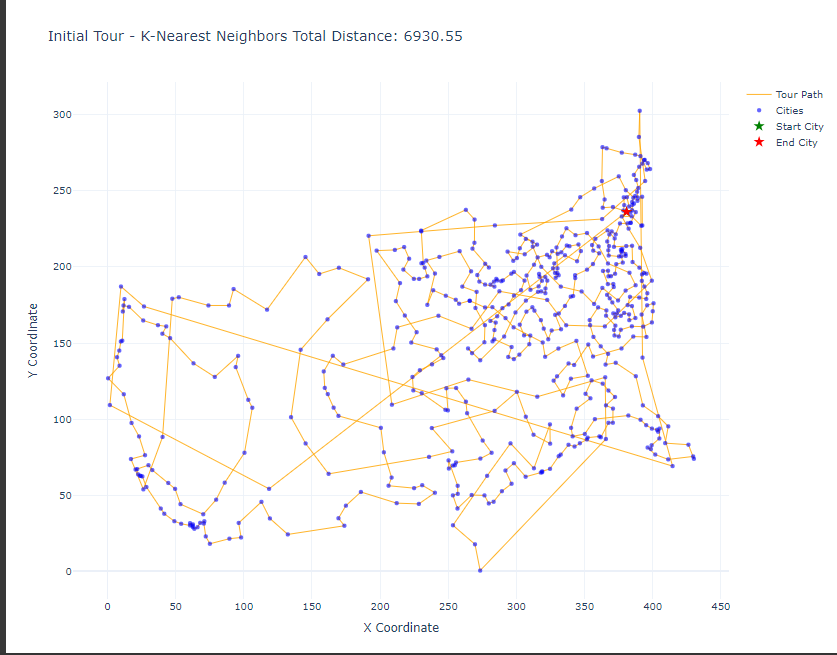
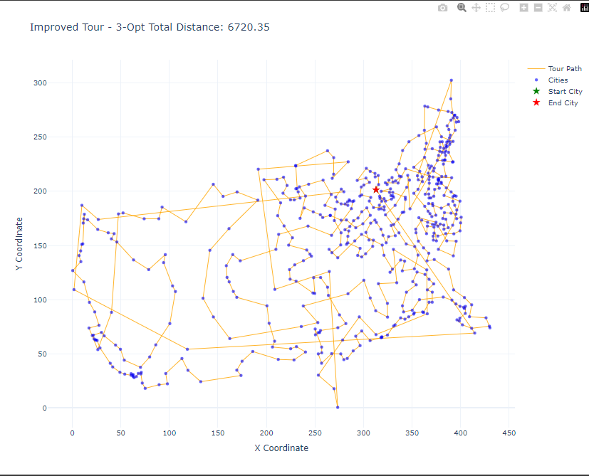

# CityCoordinatesAlgorithm for Autonomous Systems: Hackathon Challenge

An innovative solution for optimizing routes in autonomous systems by solving the **Traveling Salesman Problem (TSP)** using advanced algorithms and interactive visualizations.

---

## Overview

This project is designed to tackle the classical TSP problem, commonly applied in logistics, robotics, and autonomous systems. By comparing multiple optimization algorithms, the project demonstrates:

- **Efficient Routing Algorithms** for TSP solutions.
- **Interactive Visualizations** of cities and calculated tours.
- **Performance Analysis** of different heuristics and metaheuristics.

---

## Features

- **Algorithms Implemented**:
  - **K-Nearest Neighbors (KNN):** A quick and simple heuristic to generate an initial solution.
  - **3-Opt Improvement:** Enhances the tour by performing local swaps for better paths.
  - **Lin-Kernighan Heuristic:** Advanced optimization to achieve near-optimal solutions.

- **Performance Comparison**:
  - Evaluates algorithms by tour length and computation time.

- **Visualization**:
  - Cities and tours are plotted interactively using Plotly.

- **Scalable and Modular**:
  - Can handle diverse datasets and extend to other optimization problems.

---

## File Structure

```
project_root/
|-- CityCoordinatesAlgorithm.py   # Main project script
|-- coordinates.csv               # Example dataset (add your own if needed)
|-- README.md                     # Project documentation
|-- images/                       # Directory for visualization images
    |-- initial_tour.png          # Initial tour visualization
    |-- improved_tour.png         # Improved tour visualization
    |-- final_tour.png            # Final tour visualization (Lin-Kernighan)
    |-- comparison_chart_length.png  # Comparison of tour lengths
    |-- comparison_chart_time.png    # Comparison of execution times
```

---

## How to Run

1. **Clone the Repository**:
   ```bash
   git clone https://github.com/your_username/CityCoordinatesAlgorithm.git
   cd CityCoordinatesAlgorithm
   ```

2. **Prepare Dataset**:
   Add a CSV file named `coordinates.csv` with city coordinates in the format:
   ```csv
   CityID X_Coordinate Y_Coordinate
   0      10.0         20.0
   1      15.5         30.5
   ...
   ```

3. **Run the Script**:
   ```bash
   python CityCoordinatesAlgorithm.py
   ```

4. **View Results**:
   - Outputs include:
     - **Best Tour Length**
     - **Tour Sequence**
     - **Interactive Visualizations**

---

## Visualization Examples

Below are examples of visualizations generated by the project:

### 1. Initial Tour - KNN

- **Tour Length:** 6875.24

### 2. Improved Tour - 3-Opt

- **Tour Length:** 6720.35

### 3. Final Tour - Lin-Kernighan

- **Tour Length:** 5889.07

### 4. Comparison of Tour Lengths


### 5. Comparison of Execution Times


---

## Results

- **Initial Tour (KNN):** Length = 6875.24, Time = 0.64s
- **Improved Tour (3-Opt):** Length = 6720.35, Time = 41.64s
- **Final Tour (Lin-Kernighan):** Length = 5889.07, Time = 146.18s

Additional Results:
- **Nearest Neighbor (Multi-Start):** Length = 5220.83, Time = 1.32s
- **NN + 2-opt:** Length = 5086.96, Time = 5.34s
- **Ant Colony Optimization:** Length = 6338.44, Time = 22.46s

---

## Applications

- **Autonomous Vehicle Routing**
- **Logistics and Delivery Optimization**
- **IoT Systems with Route Planning**
- **Robotics Pathfinding**

---

## License

This project is licensed under the MIT License. See the [LICENSE](LICENSE) file for details.

---

## Contributions

Contributions are welcome! Feel free to submit a pull request or open an issue.

---

## Contact

For questions or feedback, reach out via:

- **GitHub Issues**: [Open an issue](https://github.com/your_username/CityCoordinatesAlgorithm/issues)
- **Email**: your_email@example.com

---

Enjoy exploring the fascinating world of TSP and autonomous systems!
